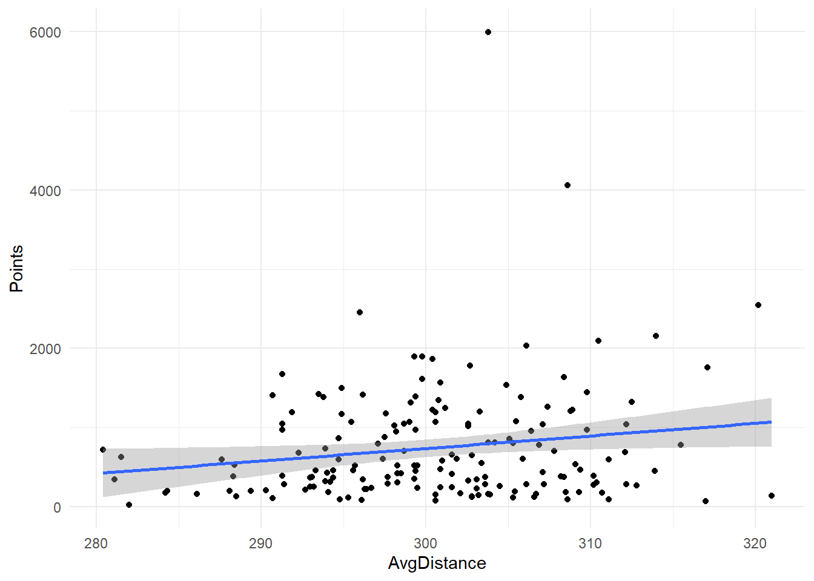
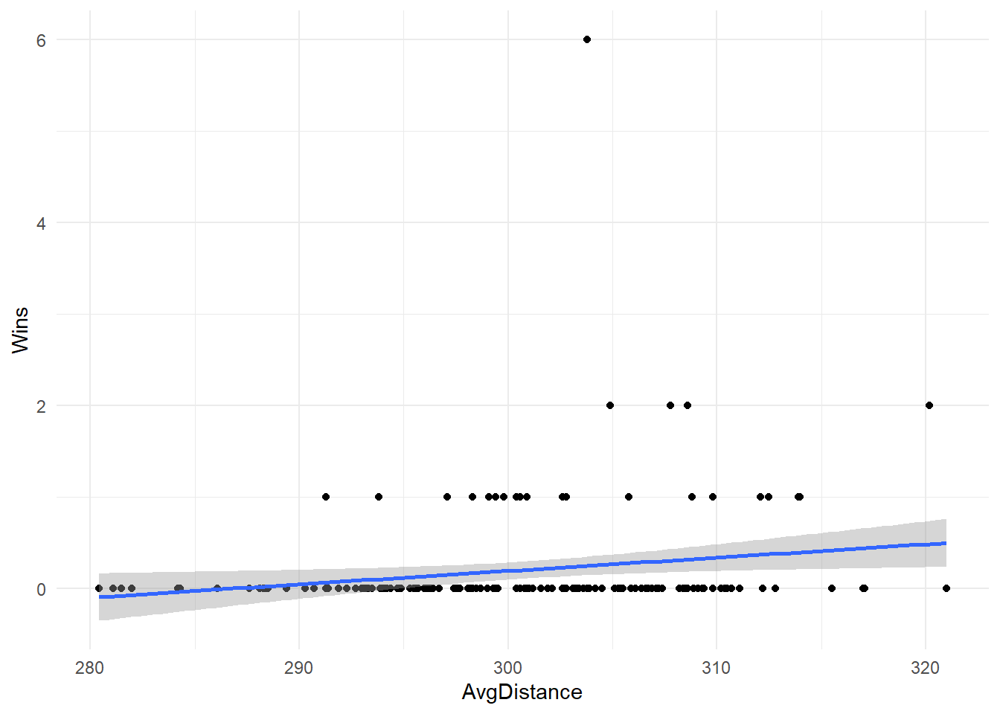
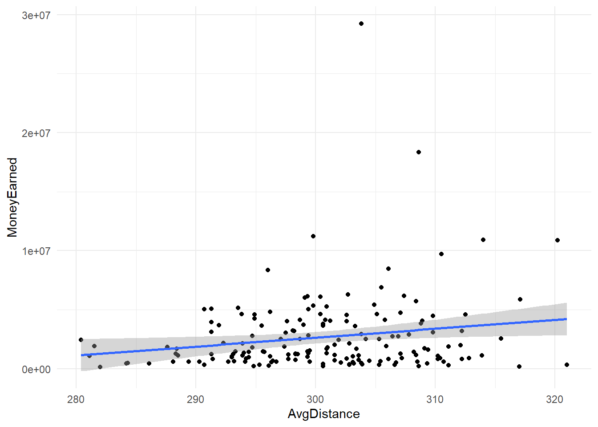

# Analyzing Driving Distances and The USGA Golf Ball Rollback

This project explores whether longer driving distances on the PGA Tour are strong indicators of success — defined by wins, earnings, and FedEx Cup points. The analysis was conducted using linear regression models on 2024 season data, and it was completed as my final project for the MSBA Data Wrangling course at the University of Notre Dame.

## View the Report

You can view the full HTML report here:  
📄 [PGA Driving Distance & USGA's Golf Ball Rollback Report](https://aheck3.github.io/pga-driving-distance-analysis/driving-distance-report.html)

## Background

In late 2023, the USGA announced a planned rollback of golf ball distance, aiming to reduce how far golf balls travel by approximately 5% starting in 2028. The decision was based on growing concerns over distance gains in professional golf and the long-term implications for course design and sustainability.

As a lifelong competitive golfer — and someone who is not among the longest hitters — this topic is personally meaningful. Throughout my college career, I was known for my driving accuracy rather than power, often finding success despite being outdriven by competitors. With the USGA’s new policy on the horizon, I wanted to investigate whether distance truly correlates with competitive success on the PGA Tour.

## Objective

The central question: **Does average driving distance meaningfully predict a player’s success on the PGA Tour?**

Success was measured using three key metrics:
- **FedEx Cup Points**
- **Total Wins**
- **Money Earned**

## Data

The dataset combines PGA Tour statistics from the 2024 season, pulled from pgatour.com. It includes 168 players and 11 variables — such as average driving distance, wins, earnings, and FedEx Cup points. The data was cleaned in Excel and analyzed using R.

## Methodology

I used simple linear regression models to examine the relationship between driving distance and each of the three success indicators. Visualizations were created with `ggplot2`, and the strength of each model was assessed using R-squared values.

## Results

Across all three models, the R-squared values were extremely low:
- Driving Distance vs. FedEx Cup Points: **0.028**  
  

- Driving Distance vs. Wins: **0.033**  
  

- Driving Distance vs. Money Earned: **0.032**  
  

Despite low p-values indicating weak statistical significance, the low R-squared values suggest that driving distance alone is not a reliable predictor of player success on tour.

## Conclusion

This analysis supports the idea that **driving distance is not the primary factor in determining success** at the professional level. Other aspects of a golfer’s game — such as accuracy, short game, and course management — play a crucial role.

As a fan and a player, I worry that the USGA’s rollback may unintentionally hurt the growth of the game. Power and distance have become a source of excitement for fans, especially younger players. Limiting that aspect of the game may reduce interest at a time when golf is growing globally.

## Files Included

- `driving-distance-analysis.qmd`: Quarto source file
- `driving-distance-report.html`: Final rendered report
- `driving-distance-rollback-analysis-presentation.pdf`: Presentation slides
- `images/`: Visualizations used in the report
- `pga-2024-data/`: Cleaned CSV data used for analysis

## Author

Alex Heck  
MSBA, University of Notre Dame  
[GitHub Profile](https://github.com/aheck3)